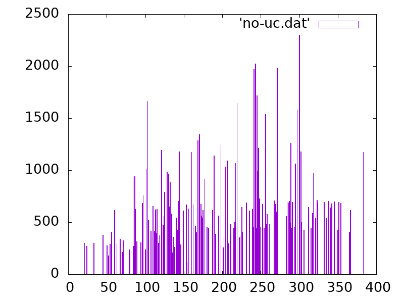

# Indexed frame distribution

Will output statistics of indexed frames over time given a `.stream` file, binned by 1000 frames:

```
cargo run -r my.stream
```

The idea would be that you redirect the output to a file and plot this file using, for example, gnuplot:

```
cargo run -r my.stream > histogram.dat

gnuplot

gnuplot> set boxwidth 0.5
gnuplot> set output 'testimage.png'
gnuplot> set terminal png size 800,600
gnuplot> plot histogram.dat' with boxes
```

Resulting in something like this:



Where you can then see distribution of found indexed frames over time.

There is a full example gnuplot file in this repository under `uc-plot.gnuplot` and the command-line to run it is in `generate-example-plot.sh`
